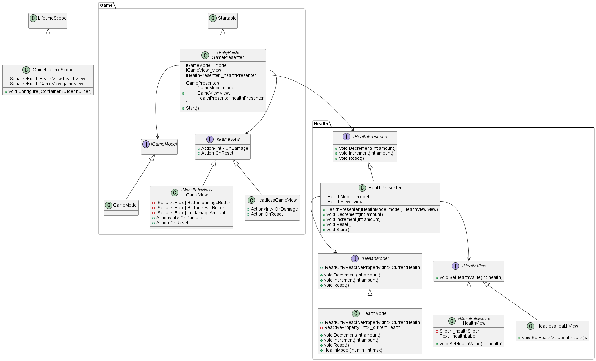

# DI-Used-Pure-MVP-testbed

## About

UnityにおけるMVPアーキテクチャの実装について、Viewコンポーネント以外を非MonoBehaviourなロジックにした場合にどうなるのかを試すためのプロジェクト。
IoCやコンストラクタ制約による依存関係の明確化、テステビリティの向上などに期待してやってみたが、
あまり実践的だとは思わなかった。
DIコンテナとしてVContainerを使用している。

## Usage

`Assets/Pure-MVP-Testbed/Scenes/Main.unity`を再生すると、以下のような簡単なシーンが実行される。

- HPがゲージとラベルで可視化されている
- ボタンによってHPを増減させることができる

https://user-images.githubusercontent.com/11372210/204098731-91ce07f1-b483-4565-b5a1-be2acaf7f444.mp4

## Architecture

[PlantUML](./Assets/Pure-MVP-Testbed/health%20structure.puml)

HPの表示周りにまつわるロジックとゲーム全体のロジックがあり、この二つのMVPが親子関係になっている。
ボタンによるHPの増減をHPにまつわるロジックに含めることもできたが、Presenterの親子関係を構成したかったためこのようにしている。

２つのViewコンポーネントのみがMonoBehaviourを継承しており、他はPure C#なクラスである。
またGamePresenterはVContainerの`IStartable`インターフェースを実装しており、エントリポイントとして機能する。

## License

本来プロジェクトは[UniRx](https://github.com/neuecc/UniRx)
および[VContainer](https://github.com/hadashiA/VContainer)
を使用しています。